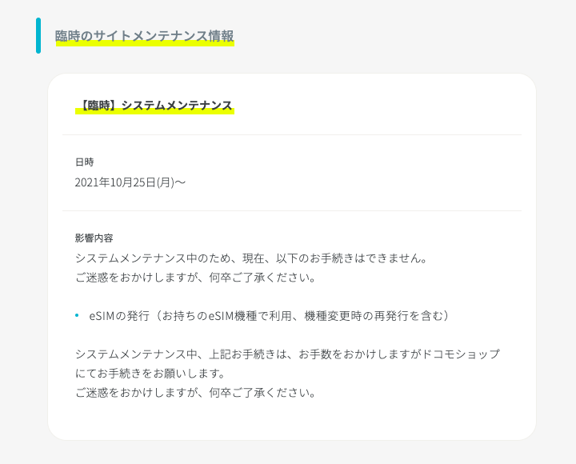
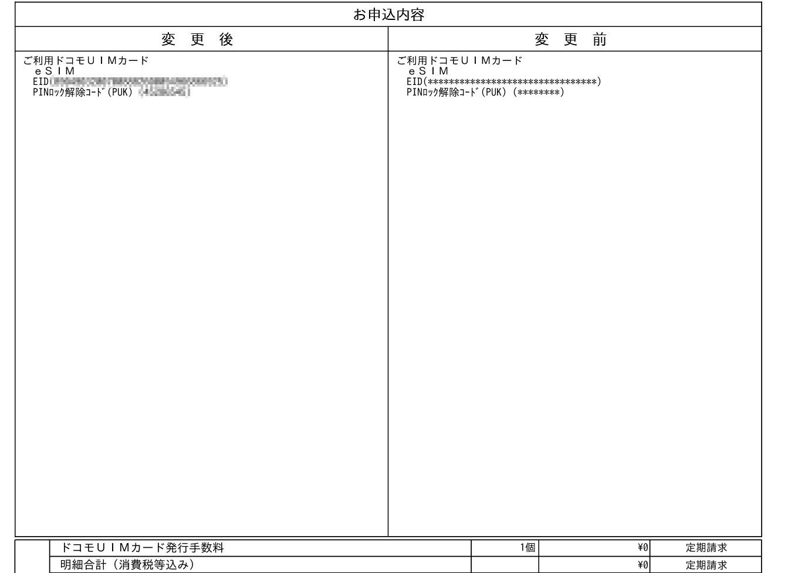

iPhone 13 miniを購入したためeSIMをサイトから再発行しようとしたが、メンテナンスでできなかったので再発行する方法をまとめる。  
現在、ahamoでは2021年10月25日から臨時システムメンテナンスを行っているためサイト上で手続きができずドコモショップで手続きを行う必要がある。
<!-- end -->

[ahamo](https://ahamo.com/) > ログイン > その他の手続き > eSIM発行・再発行のお手続き へ進むとメンテナンス情報が表示される。
  

  
予約はしていなかったがドコモショップに行ってみた。
  
### ドコモショップでの対応
受付の店員さんに「eSIMの再発行をお願いします」と行ってもあまり理解してくれなかったのでスマホでメンテナンスのページを見せたら理解してくれた。

[メンテナンス情報一覧 | ahamo](https://ahamo.com/maintenance/)
  
ちょうど窓口が空いていたのでそのまま対応してもらう。
  
### 窓口での対応
担当の店員さんが変わってeSIMの手続きをしてもらったが、初めてする手続きなのか随時専門部署に電話をしながらの対応でなかなか進まなかった。  
通常ドコモの窓口て手続きをすると手数料がかかるが、今回はメンテンス中で手数料無料のため減算処理の仕方を担当の方は伺っていた。  
注文内容の書面でEIDに間違いがないか客側も確認する。  
EIDは32桁もあるのでよく確認すること。  
請求は0円となっていて手数料は発生しない。  
  

  
登録完了後、旧端末のアンテナピクトの表示が消えるので、再度プロファイルの設定をする。
ドコモオンラインショップの[eSIM設定方法のページ](https://onlineshop.smt.docomo.ne.jp/supports/settings/index.html?ds_device=eSIMonly#eSIMonly_choice)からSM-DP+アドレスをコピー。
iPhoneのモバイル通信プランの追加設定欄にSM-DP+アドレスを貼り付けると新たにプランが追加される。  
再起動して通信ができることを確認した。  
  
eSIMの再発行のためだけにドコモショップへ行かなければならないのはしんどいので早くメンテナンスを終えてほしい。  
ahamoを使ってる人でeSIMの再発行の際に参考になれば幸いです。
